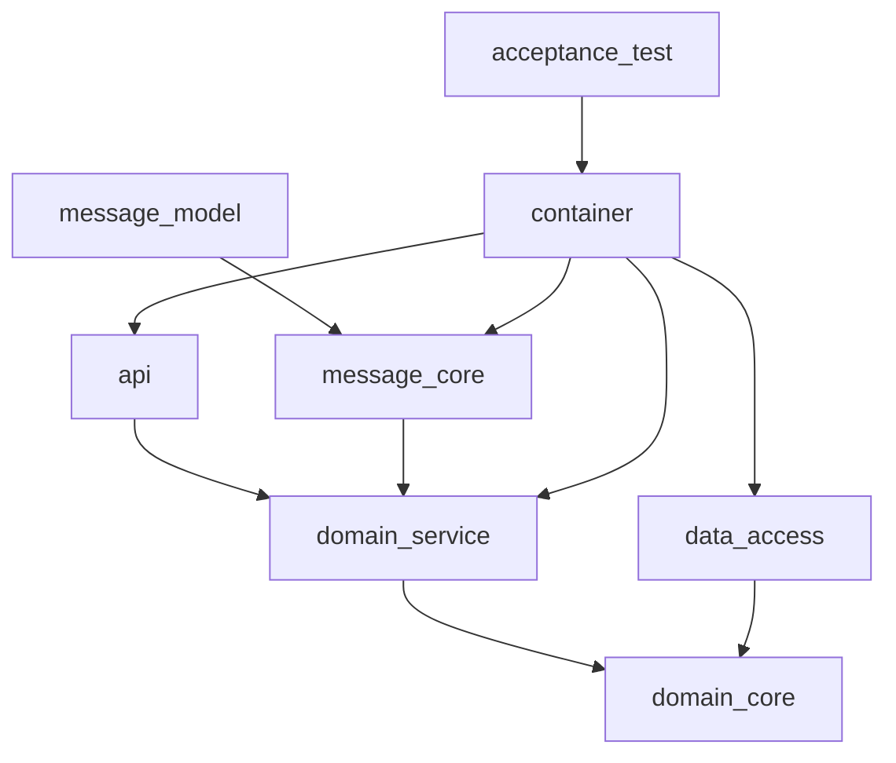

# Design — LG-92-upgrade-springboot-exec

## 1. Introduction
This design defines the technical strategy for upgrading the platform to Spring Boot 4.0.0, as specified in `docs/specs/LG-92-upgrade-springboot-exec/prd.md`. The design focuses on dependency management, deprecated API refactoring, maintaining test suite compatibility, and CI/CD adjustments.

- **REQ-001** (Dependency Update) covered in §2.
- **REQ-002** (API Refactoring) covered in §3.
- **REQ-003** (Functional Integrity) covered in §4, §5.
- **REQ-004** (CI/CD Stability) covered in §6.

## 2. Dependency Management Strategy
Following **ADR-001**, all dependencies are centralized in `gradle/libs.versions.toml`.

- **Action:** Update all Spring Boot 3.x dependencies to the Spring Boot 4.0.0 equivalent baseline.
- **Constitutional Reference:** Adheres to **RULE-001** (Stack Baseline) and **RULE-002** (Parent POM).
- **Validation:** `gradle build` and `dependencyCheck` report no unresolved conflicts.

## 3. Code Refactoring (Deprecated APIs)
To satisfy **REQ-002**, we will address API deprecations:

- **Identification:** Run `./gradlew compileJava -Werror` to fail on warnings during migration.
- **Refactoring:** Replace deprecated interfaces/methods with their designated replacements.
- **Constitutional Reference:** Ensures compliance with `lg5-spring` coding standards as defined in **RULE-015** (Records for DTOs, `final` fields).

## 4. Acceptance Test Compatibility (`lg5-spring-acceptance-test`)
To satisfy **REQ-003**, we ensure the test suite is compatible:

- **Action:** Update Cucumber and JUnit Platform dependencies to versions compatible with Spring Boot 4.0.0.
- **Strategy:** Follow **ADR-002** (Incremental Validation). Tests will be executed in a containerized environment (Testcontainers).
- **Constitutional Reference:** Complies with **RULE-012** (ATDD structure: `@ActiveProfiles`, `Lg5TestBoot`).

## 5. Testcontainers Compatibility (`lg5-spring-testcontainers`)
- **Action:** Update Testcontainers library dependencies.
- **Validation:** Verify `testcontainers.<name>.enabled` remains functional with the new Spring Boot context.
- **Constitutional Reference:** Complies with **RULE-013** (Testcontainers opt-in).

## 6. CI/CD Pipeline Adjustments
- **Action:** Update the pipeline definitions (`.github/workflows/*.yml`) to use the JDK 21 zulu container image.
- **Compatibility:** Ensure the composite action `setup-maven-credentials` is still compatible with the new build environment.
- **Constitutional Reference:** Aligns with **RULE-009** (CI/CD topology).

## 7. Cross-cutting Concerns
- **Observability:** Verify Micrometer registry configuration remains functional for metrics.
- **Liquibase:** Perform a dry-run migration to ensure SQL scripts remain valid under the new Spring Boot version.

## 8. Module Dependency Graph
The following acyclic module dependency graph is maintained, consistent with the 8-module shape requirement (**RULE-004**):

## 9. Requirement Traceability
| REQ | Sections covering it |
|-----|----------------------|
| REQ-001 | §2 |
| REQ-002 | §3 |
| REQ-003 | §4, §5 |
| REQ-004 | §6 |

## 10. Skipped sections
- §4 (Distributed Transactions) — Skipped: Feature does not change transaction management.
- §5 (Event Sourcing) — Skipped: Feature does not change event sourcing.
- §6 (Saga/Choreography) — Skipped: Feature does not change saga orchestration.
- §7 (API/Contract Docs) — Skipped: Feature does not introduce new API contracts.
- §8 (Observability/Metrics) — Skipped: Covered in §7.
- §9 (Data Model) — Skipped: Feature involves no changes to persistent state, aggregates, or schemas, thus `data-model.md` is omitted.

## 11. Open questions
- Are there any specific libraries currently in use that are *not* compatible with Spring Boot 4.0.0? (Need to investigate during initial dependency update step).

## Definition of Done (Design)
- [x] Every REQ mapped to ≥1 design section.
- [x] Every ADR implemented.
- [x] Every constitutional rule cited (RULE-001, RULE-002, RULE-004, RULE-009, RULE-012, RULE-013, RULE-015).
- [x] Dependency graph is acyclic.
- [x] Skipped sections justified.
- [x] Open questions surfaced in §11.
